# Microsoft Sentinel Detection Lab 


## Overview

This project documents setting up Microsoft Sentinel as a SIEM, configuring log ingestion from a Windows endpoint, and enabling analytic rule templates from the Sentinel Content Hub. Alerts were triggered on the endpoint VM using Atomic Red Team simulations. For each alert, an analysis was performed and documented to validate the test behavior, confirm the activity executed successfully, and collect supporting evidence using custom KQL queries in Sentinel. Each alert also includes response and prevention recommendations based on the observed activity.


## Tools Used

- Virtualization: VMware Workstation (Windows 11 VM)
- Telemetry: Sysmon (SwiftOnSecurity config), Windows Security Events
- SIEM + Ingestion: Microsoft Sentinel, Log Analytics, Azure Arc, AMA, DCR/DCE
- Adversary simulation: Atomic Red Team (Invoke-AtomicRedTeam)
- Framework: MITRE ATT&CK


---


<details>
<summary><strong>Virtual Machine Setup</strong></summary>

## Windows 11 VM + Sysmon

A Windows 11 VM (`Sentinel-Lab`) was built in VMware Workstation and used as the lab endpoint. Sysmon was installed to generate detailed process, network, and file telemetry for Sentinel investigations.


### Windows 11 VM (Victim)


- VM Name: `Sentinel-Lab`
- Hypervisor: VMware


#### Sysmon

Sysmon was installed using SwiftOnSecurity’s configuration.

<br>

**SwiftOnSecurity config:** https://github.com/SwiftOnSecurity/sysmon-config


<br>
<br>

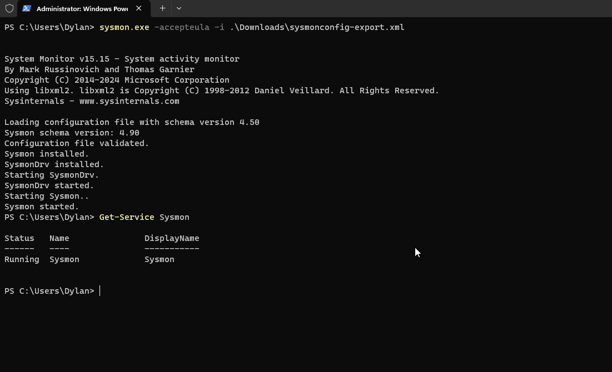


---

<br>

</details>


<details>
<summary><strong>SIEM Setup</strong></summary>

## SIEM Setup + Log Ingestion


### Log Analytics Workspace

A new Log Analytics Workspace named `SentinelLab` was created in a resource group named `sentinellab`.

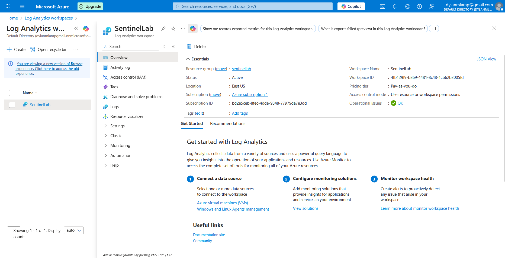

<br>
<br>

### Microsoft Sentinel

Microsoft Sentinel was then added by finding Microsoft Sentinel in the Azure portal and adding it to the `SentinelLab` workspace.


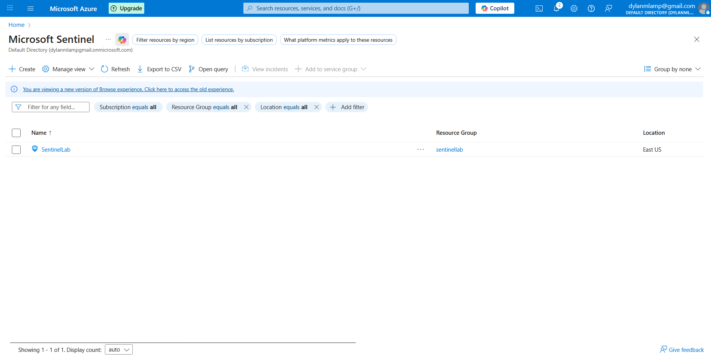

<br>
<br>

### Onboard to Azure Arc

Because the VM is local and not an Azure VM, Azure Arc is used to register it as an Azure resource. This allows the machine to be monitored and interacted with.

Steps completed:

- Azure Portal > Azure Arc > Onboard existing machines with Azure Arc > download onboarding script
- Transfer script to VM > run script > authenticate to Azure
- Confirm the machine appears under the `sentinellab` resource group via Resource Manager


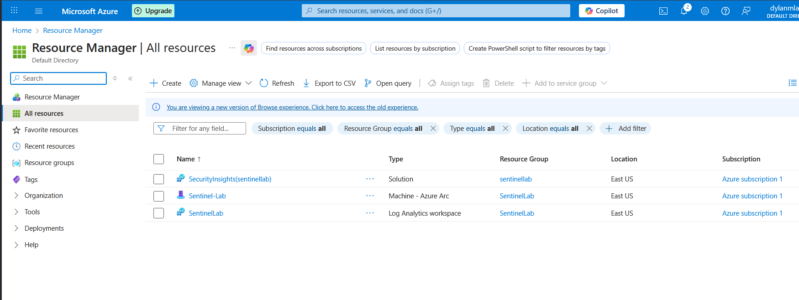

<br>

### Log Ingestion

Log ingestion was configured using:

- **Data Collection Rules (DCR)**- to collect Sysmon/Application/System logs into Log Analytics
- **Azure Monitor Agent (AMA)**- to collect and forward logs
- **Data Collection Endpoint (DCE)**- used as the endpoint referenced by the DCR

<br>

#### 1. Data Collection Rule

A DCR named `DCR-Windows-Sysmon` was created with the following **Windows Event Logs** sources:

```
Microsoft-Windows-Sysmon/Operational!*
Application!*
System!*
```


> Security logs were not included in this DCR as to avoid duplicate collection. Windows Security logs were collected with the Sentinel **Windows Security Events via AMA** connector so that events go into the **SecurityEvent** table. This table is what the rule templates chosen were built to use.

<br>

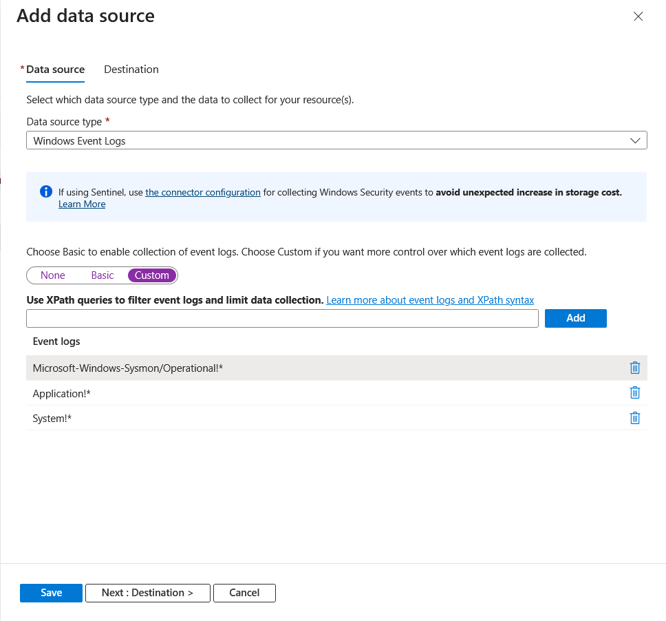

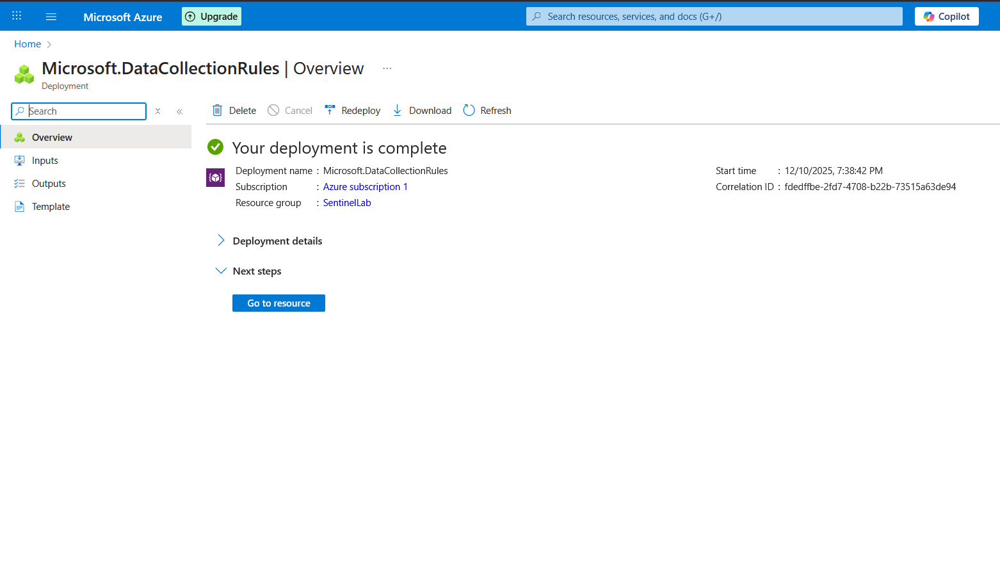

<br>
<br>

#### 2. Azure Monitor Agent

Once the DCR was created with the Arc VM as a resource, the AMA (`AzureMonitorWindowsAgent`) extension was deployed to the VM.

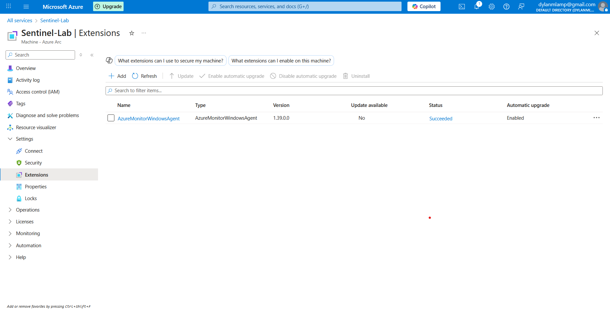

<br>
<br>

#### 3. Data Collection Endpoint

A DCE named `DCE-SentinelLab` was created and linked to `DCR-Windows-Sysmon` as the ingestion endpoint reference.

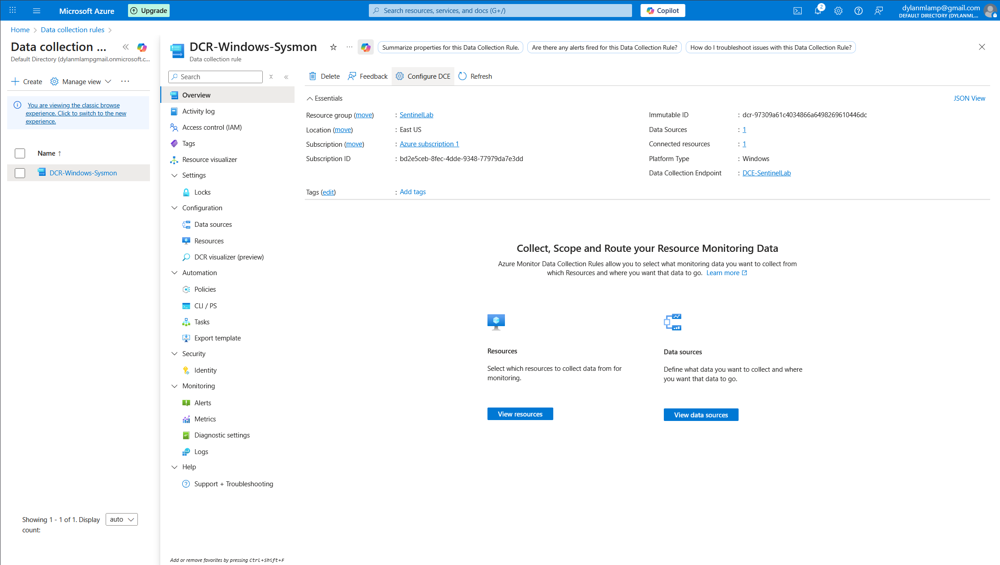

<br>
<br>

### Windows Security Events via AMA (SecurityEvent table)

The **Windows Security Events via AMA** connector was configured with a new DCR named `securityevent` to collect Security logs from the endpoint and populate the **SecurityEvent** table.


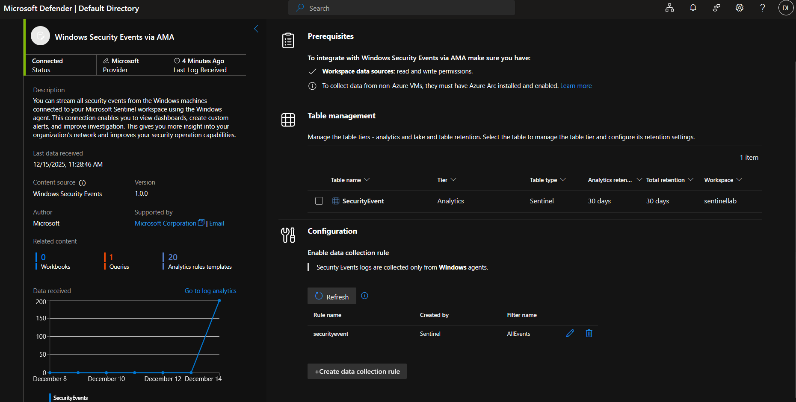

<br>
<br>

### Verify Log Ingestion
The following queries were run to ensure the chosen log sources were being collected and ingested into `SentinelLab`.

<br>

**Events check**
```kql
Event
| summarize dcount(EventID) by EventLog
```

**SecurityEvents check**
```kql
SecurityEvent
| take 500
| project TimeGenerated, Computer, EventID
```


<br>

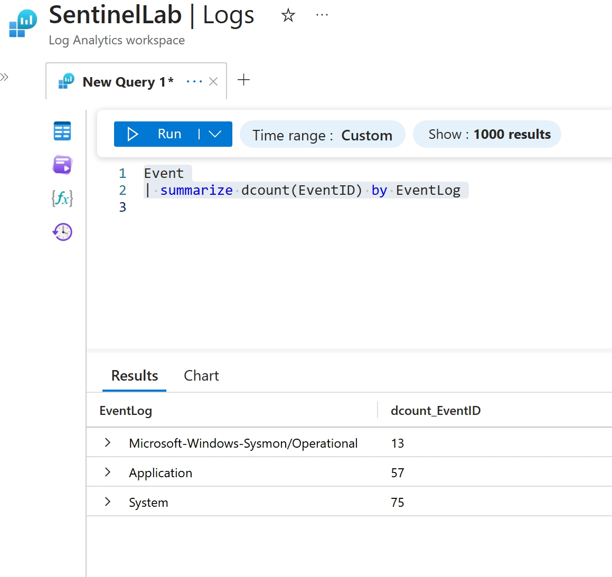
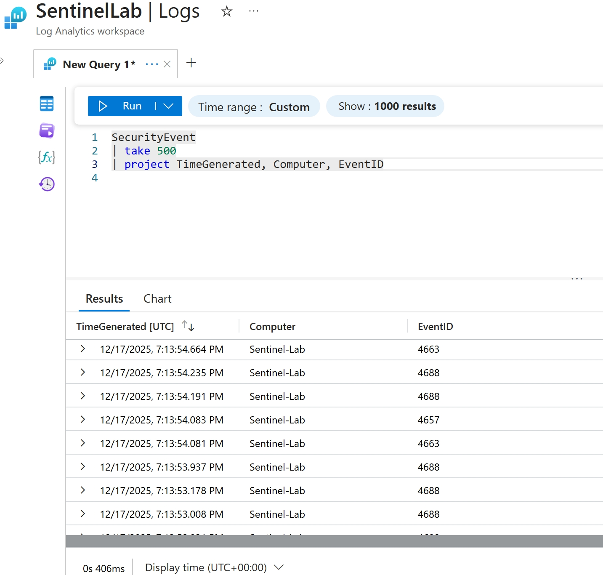

---

<br>

</details>


<details>
<summary><strong>Detection Setup</strong></summary>

## Detection Setup

Sentinel analytic rule templates were enabled from **Content Hub** solutions to detect a small set of ATT&CK techniques that can be simulated on a single Windows host. Where a rule depended on specific event IDs or fields, Windows auditing and Sysmon settings were adjusted so the rule query had the data it expects.


### Testing Scope

| Tactic | Technique |
|---|---|
| Defense Evasion | [T1070.001 — Indicator Removal: Clear Windows Event Logs](https://attack.mitre.org/techniques/T1070/001/)<br>[T1036.003 — Masquerading: Rename System Utilities](https://attack.mitre.org/techniques/T1036/003/) |
| Privilege Escalation | [T1548.002 — Abuse Elevation Control Mechanism: Bypass User Account Control](https://attack.mitre.org/techniques/T1548/002/) |
| Credential Access | [T1003.001 — OS Credential Dumping: LSASS Memory](https://attack.mitre.org/techniques/T1003/001/) |


For lab simplification, ATT&CK techniques were selected based on:
- Analytic rule templates available from the Microsoft Sentinel **Content Hub**
- Ability to execute on a single Windows VM
- Atomic Red Team tests available


<br>


### Content Hub Solutions Installed

Detection rules were installed from the following Microsoft Sentinel **Content Hub** solutions.

- **Windows Security Events**
- **Endpoint Threat Protection Essentials**


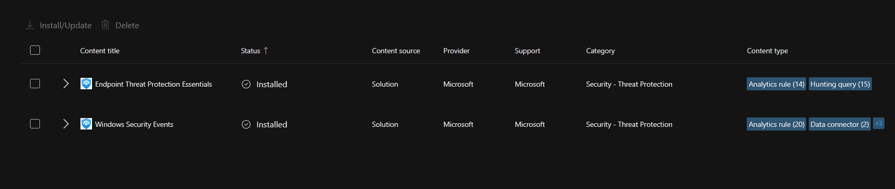


<br>
<br>

### Rule Templates Enabled

Detection rule templates were created by selecting the template and choosing **Create rule** with default settings. To access them:

**Microsoft Sentinel > Configuration > Analytics > Rule templates**


<br>


> Some detections require additional configurations to the Windows VM such as collecting event ID 4688, which is not enabled by default. The additional configurations made are listed below.


| Technique | Detection rule | Additional configuration needed for rule |
|---|---|---|
| T1036.003 — Rename System Utilities | Windows Binaries Lolbins Renamed | - Updated the template’s `procList` to the executables used by the Atomic Red Team test |
| T1548.002 — Bypass User Account Control | Potential Fodhelper UAC Bypass | - Enable **Audit Process Creation** (ID 4688)<br>- Enable **“Include command line in process creation events”** (so 4688 has CommandLine)<br>- Enable **Audit Registry** and apply **SACL** on `HKCU\Software\Classes\ms-settings\shell\open\command` (ID 4657) |
| T1003.001 — LSASS Memory | Dumping LSASS Process Into a File | - Enable **Sysmon Event ID 10 (ProcessAccess)**<br>- Add a targeted Sysmon rule to log access to **`lsass.exe`** (so EID 10 actually captures it) |


---

<br>
<br>

</details>


<details>
<summary><strong>Attack Simulation</strong></summary>

## Attack Simulation

Atomic Red Team was used to execute controlled and repeatable attack simulations on the endpoint VM (`Sentinel-Lab`). Each test was run from a clean snapshot, validated in Sentinel, and the VM was reverted to keep the environment consistent.


### Atomic Setup
- Atomic Red Team: https://github.com/redcanaryco/atomic-red-team  
- Install guide: https://github.com/redcanaryco/invoke-atomicredteam/wiki/Installing-Invoke-AtomicRedTeam

**Framework & atomics installation**
```powershell
IEX (IWR 'https://raw.githubusercontent.com/redcanaryco/invoke-atomicredteam/master/install-atomicredteam.ps1' -UseBasicParsing);
Install-AtomicRedTeam -getAtomics
```

**Defender exclusion so that Atomics are not deleted**
```powershell
Add-MpPreference -ExclusionPath "C:\AtomicRedTeam"
```

**PowerShell profile to auto import the module**
```powershell
Import-Module "C:\AtomicRedTeam\invoke-atomicredteam\Invoke-AtomicRedTeam.psd1" -Force
$PSDefaultParameterValues = @{"Invoke-AtomicTest:PathToAtomicsFolder"="C:\AtomicRedTeam\atomics"}
```

<br>

### Testing Procedure
1. Select test and take a VM snapshot
2. Disable real-time protection for Microsoft Defender 
3. Check prerequisites: `Invoke-AtomicTest <TECHNIQUE> -TestNumbers <NUMBERS> -CheckPrereqs` and use `-GetPrereqs` if needed
4. Run relevant tests with `Invoke-AtomicTest <TECHNIQUE> -TestNumbers <NUMBERS>`
5. Investigate and document incidents generated by Microsoft Sentinel
6. Revert to the last VM snapshot

<br>

### Tests Executed
| Technique | Atomic Technique Page | Test # |
|---|---|:---:|
| T1036.003 — Rename System Utilities| https://www.atomicredteam.io/atomic-red-team/atomics/T1036.003 | 3, 4, 5, 7, 8 |
| T1548.002 — Bypass User Account Control| https://www.atomicredteam.io/atomic-red-team/atomics/T1548.002 | 3 |
| T1003.001 — LSASS Memory| https://www.atomicredteam.io/atomic-red-team/atomics/T1003.001 | 1 |
| T1070.001 — Clear Windows Event Logs| https://www.atomicredteam.io/atomic-red-team/atomics/T1070.001 | 2 |


---

<br>
<br>

</details>


<details>
<summary><strong>Alert 1</strong></summary>

## Alert 1 — T1036.003 (Rename System Utilities)

<br>

**Alert Information**
- **Title:** Windows Binaries Lolbins Renamed  
- **Severity:** Medium  
- **Time (EST):** Dec 17, 2025 8:29:30 PM – 8:31:33 PM  
- **Entity:** Host `Sentinel-Lab`  
- **Incident ID:** 48  


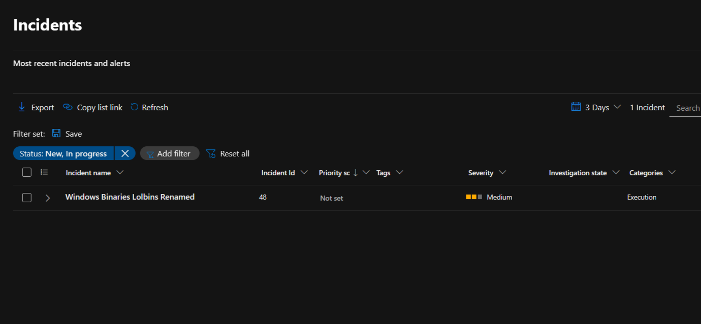

---


### Summary

This alert triggered because multiple Sysmon EID 1 events showed Windows executables being run under different filenames. Network activity showed 2 GitHub connections in the same window and a PowerShell download of the Atomic Red Team payload corresponding to a test. Review of the child processes did not show further execution after the renamed executable activity.

<br>

### Actions Taken

<br>

1. Reviewed the original analytic rule query output to confirm why the rule fired:

```kql
// The query_now parameter represents the time (in UTC) at which the scheduled analytics rule ran to produce this alert.
set query_now = datetime(2025-12-18T02:04:20.2823553Z);
let procList = dynamic(["cscript.exe", "wscript.exe", "powershell.exe", "cmd.exe", "mshta.exe", "rundll32.exe", "regsvr32.exe"]);
Event
| where EventLog =~ "Microsoft-Windows-Sysmon/Operational" and EventID==1
| parse EventData with * 'Image">' Image "<" * 'OriginalFileName">' OriginalFileName "<" *
| where OriginalFileName has_any (procList) and not (Image has_any (procList))
| parse EventData with * 'ProcessGuid">' ProcessGuid "<" * 'Description">' Description "<" * 'CommandLine">' CommandLine "<" * 'CurrentDirectory">' CurrentDirectory "<" * 'User">' User "<" * 'LogonGuid">' LogonGuid "<" * 'Hashes">' Hashes "<" * 'ParentProcessGuid">' ParentProcessGuid "<" * 'ParentImage">' ParentImage "<" * 'ParentCommandLine">' ParentCommandLine "<" * 'ParentUser">' ParentUser "<" *
| summarize StartTime = min(TimeGenerated), EndTime = max(TimeGenerated) by EventID, Computer, User, ParentImage, ParentProcessGuid, ParentCommandLine, ParentUser, Image, ProcessGuid, CommandLine, Description, OriginalFileName, CurrentDirectory, Hashes
| extend HostName = iif(Computer has '.',substring(Computer,0,indexof(Computer,'.')),Computer) ,
         DnsDomain = iif(Computer has '.',substring(Computer,indexof(Computer,'.')+1),'')
```

<br>

**Why the rule fired** - Sysmon Event ID 1 showed 5 instances where `Image` did not match `OriginalFileName`.

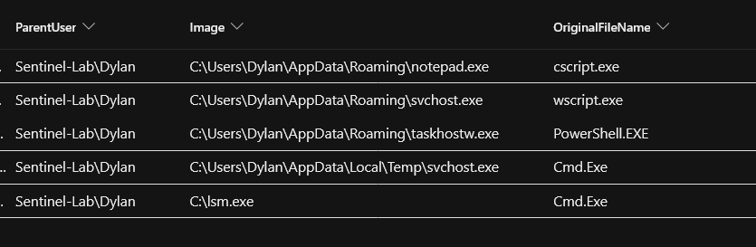

<br>
<br>

2. Examined each instance for further information

    - `cmd.exe` executed `cscript.exe` renamed as `notepad.exe` in `AppData\Roaming` at **8:29:30 PM**  

        

    - `cmd.exe` executed `wscript.exe` renamed as `svchost.exe` in `AppData\Roaming` at **8:29:31 PM**  

        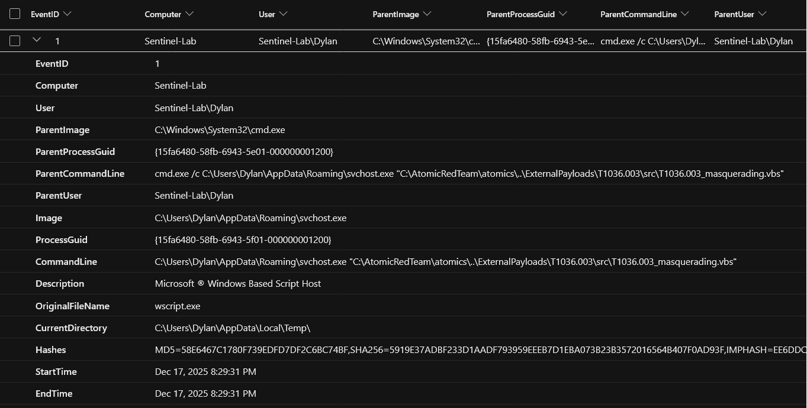

    - `cmd.exe` executed `powershell.exe` renamed as `taskhostw.exe` in `AppData\Roaming` at **8:29:31 PM**  

        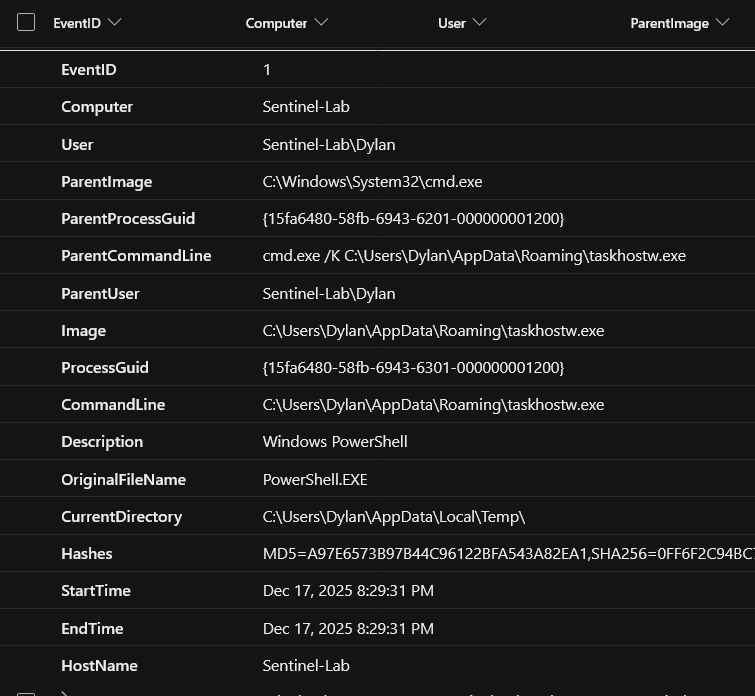

    - `powershell.exe` copied `cmd.exe` as `svchost.exe` in `AppData\Local\Temp` at **8:31:32 PM**  

        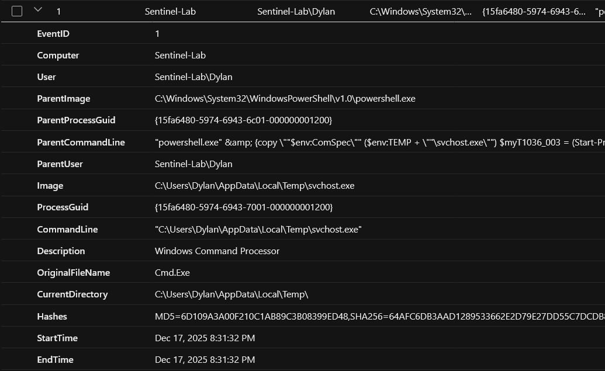

    - `cmd.exe` copied itself as `lsm.exe` into `C:\` at **8:31:33 PM**  

        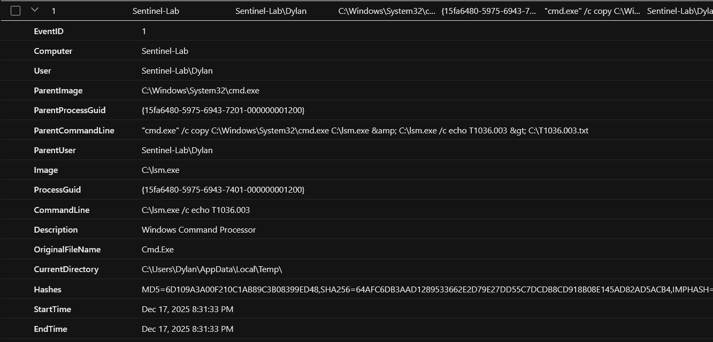

<br>
<br>

3. Examined network connections from the machine in the time window leading up to the incident.

```kql
Event
| where TimeGenerated between (datetime(2025-12-18 01:25:00) .. datetime(2025-12-18 01:35:00))
| where Computer == "Sentinel-Lab"
| where EventLog == "Microsoft-Windows-Sysmon/Operational" and EventID == 3
| project TimeGenerated, Computer, EventID, RenderedDescription
| order by TimeGenerated desc
```

Results showed PowerShell established 2 HTTPS connections to GitHub infrastructure:
- `185.199.110.133` (`cdn-185-199-110-133.github.com`)
- `140.82.113.3` (`lb-140-82-113-3-iad.github.com`)

<br>
<br>

4. Checked Event 4688 for any evidence of downloads from those connections.

```kql
SecurityEvent
| where TimeGenerated between (datetime(2025-12-18 01:25:00) .. datetime(2025-12-18 01:35:00))
| where Computer == "Sentinel-Lab"
| where EventID == 4688
| where CommandLine has_any ("github.com", "185.199.110.133", "140.82.113.3")
| project TimeGenerated, SubjectUserName, NewProcessName, CommandLine
| order by TimeGenerated desc
```

Results showed `powershell.exe` executed `Invoke-WebRequest` on the Atomic Red Team GitHub URL and saved a file to:
- `C:\AtomicRedTeam\atomics\..\ExternalPayloads\T1036.003\src\T1036.003_masquerading.vbs`

<br>
<br>

5. Checked whether any of the renamed processes spawned child processes during the time window by filtering on their `ProcessGuid` values.

```kql
Event
| where TimeGenerated > datetime(2025-12-18 01:28:30)
| where Computer == "Sentinel-Lab"
| where EventLog == "Microsoft-Windows-Sysmon/Operational"
| where EventID == 1
| parse EventData with * 'ParentProcessGuid">' ParentProcessGuid "<" * 
| where ParentProcessGuid in ("{15fa6480-58fa-6943-5b01-000000001200}", "{15fa6480-58fb-6943-5f01-000000001200}", "{15fa6480-58fb-6943-6301-000000001200}", "{15fa6480-5974-6943-7001-000000001200}", "{15fa6480-5975-6943-7401-000000001200}")
| parse EventData with * 'Image">' ChildImage "<" * 'ProcessGuid">' ChildGuid "<" * 'ParentImage">' ParentImage "<" *
| project TimeGenerated, ParentProcessGuid, ParentImage, ChildImage, ChildGuid
| order by TimeGenerated asc
```

Results showed child process activity only from the renamed `taskhostw.exe` (`powershell.exe`). The processes were:

`C:\Windows\System32\HOSTNAME.EXE` (2 executions)

`C:\Windows\System32\wermgr.exe` (1 execution)

No other child process creation was found from the renamed executables within the time window.

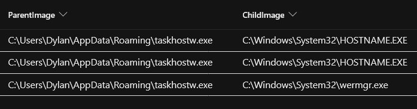


<br>
<br>

### Findings

- 5 renamed executables were found
    - `cmd.exe` executed `cscript.exe` renamed as `notepad.exe` in `AppData\Roaming` at **8:29:30 PM**  
    - `cmd.exe` executed `wscript.exe` renamed as `svchost.exe` in `AppData\Roaming` at **8:29:31 PM**  
    - `cmd.exe` executed `powershell.exe` renamed as `taskhostw.exe` in `AppData\Roaming` at **8:29:31 PM**
    - `powershell.exe` copied `cmd.exe` as `svchost.exe` in `AppData\Local\Temp` at **8:31:32 PM**  
    - `cmd.exe` copied itself as `lsm.exe` into `C:\` at **8:31:33 PM** 
- Sysmon network events showed 2 PowerShell HTTPS connections to GitHub prior to the incident
- Security process creation logs showed PowerShell executed `Invoke-WebRequest` on `T1036.003_masquerading.vbs` into the Atomic Red Team ExternalPayloads directory
- The renamed `taskhostw.exe` (`powershell.exe`) was the only renamed process that spawned child processes (`HOSTNAME.EXE` x2 and `wermgr.exe` x1)

 <br>
 <br>

### Recommendations

- Response -
    - Isolate host and preserve evidence
    - Find and remove the renamed utilities and any downloaded payloads
    - Hunt for the same renaming pattern across other endpoints
- Prevention - 
    - [Restrict File and Directory Permissions (M1022)](https://attack.mitre.org/mitigations/M1022/):
        - Enforce least privilege permissions
        - Use File Integrity Monitoring (FIM) tools to monitor changes to critical file permissions
        - Restrict write access to critical directories such as `C:\Windows\System32`, `C:\`. 


---

<br>
<br>

</details>


<details>
<summary><strong>Alert 2</strong></summary>

## Alert 2 — T1548.002 (Bypass User Account Control)

<br>

**Alert Information**
- **Title:** Potential Fodhelper UAC Bypass  
- **Severity:** Medium  
- **Time (EST):** Dec 17, 2025 1:30:34 PM  
- **Entity:** Host `Sentinel-Lab`  
- **Incident ID:** 9  


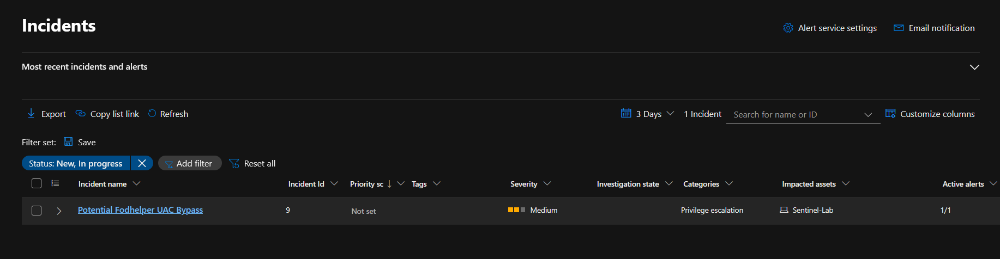

---

<br>


### Summary

The `ms-settings\shell\open\command` registry key was changed and `fodhelper.exe` was executed immediately after. A high integrity instance of `cmd.exe` from `fodhelper.exe` shows that a successful UAC bypass was achieved. No other activity was found after the initial attack.

<br>

### Actions Taken

<br>

1. Reviewed the original analytic rule query output to confirm why the rule fired:

```kql
// The query_now parameter represents the time (in UTC) at which the scheduled analytics rule ran to produce this alert.
set query_now = datetime(2025-12-17T19:10:22.4425149Z);
SecurityEvent
| where EventID == 4657
| parse ObjectName with "\\REGISTRY\\" KeyPrefix "\\" RegistryKey
| project-reorder RegistryKey
| where RegistryKey has "ms-settings\\shell\\open\\command"
| extend TimeKey = bin(TimeGenerated, 1h)
| join (
    SecurityEvent
    | where EventID == 4688
    | where Process =~ "fodhelper.exe"
    | where ParentProcessName endswith "cmd.exe" or ParentProcessName endswith "powershell.exe" or ParentProcessName endswith "powershell_ise.exe"
    | extend TimeKey = bin(TimeGenerated, 1h)
) on TimeKey, Computer
| extend HostName = tostring(split(Computer, ".")[0]), DomainIndex = toint(indexof(Computer, '.'))
| extend HostNameDomain = iff(DomainIndex != -1, substring(Computer, DomainIndex + 1), Computer)
| extend AccountName = tostring(split(TargetAccount, @'\')[1]), AccountNTDomain = tostring(split(TargetAccount, @'\')[0])
```

<br>

**Why the rule fired**
- `...\_Classes\ms-settings\shell\open\command` modified to `C:\Windows\System32\cmd.exe` by `reg.exe`
- `C:\Windows\System32\fodhelper.exe` executed with `C:\Windows\System32\cmd.exe` as the parent process

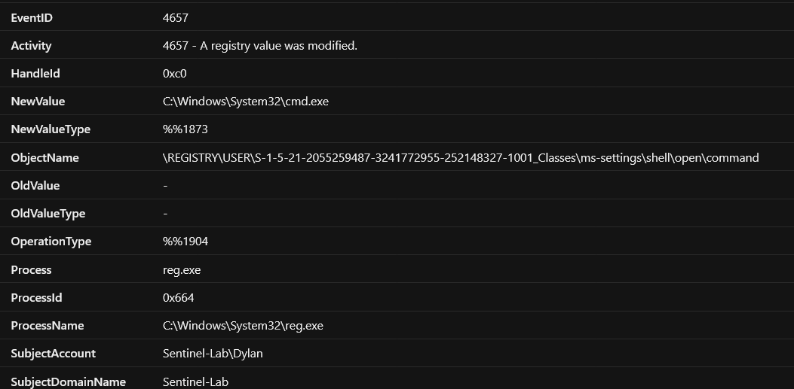

<br>
<br>

2. Examined process creation logs to find the exact commands that modified the registry.


```kql
SecurityEvent
| where TimeGenerated between (datetime(2025-12-17 18:28:00) .. datetime(2025-12-17 18:33:00))
| where Computer == "Sentinel-Lab"
| where EventID == 4688
| where NewProcessName endswith "reg.exe"
| project TimeGenerated, SubjectUserName, ParentProcessName, NewProcessName, CommandLine
| order by TimeGenerated asc
```

<br>

Results showed `cmd.exe` used `reg.exe` with the following command arguments:

- `reg.exe add hkcu\software\classes\ms-settings\shell\open\command /ve /d "C:\Windows\System32\cmd.exe" /f`
- `reg.exe add hkcu\software\classes\ms-settings\shell\open\command /v "DelegateExecute" /f`

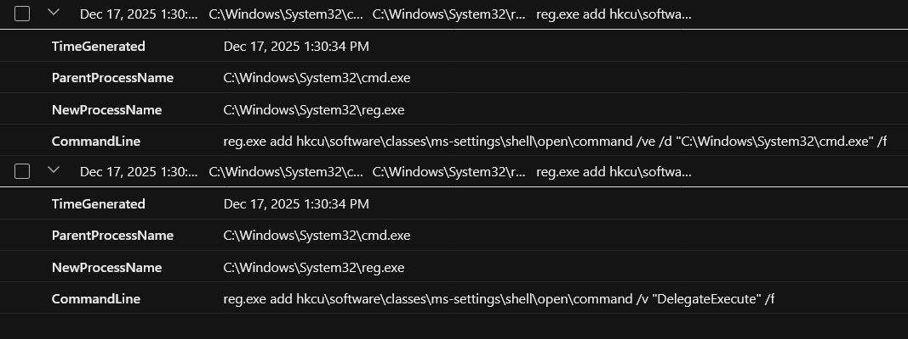

<br>
<br>

3. Verified that `fodhelper.exe` successfully created a high integrity `cmd.exe` instance.

```kql
SecurityEvent
| where TimeGenerated between (datetime(2025-12-17 18:28:00) .. datetime(2025-12-17 18:33:00))
| where Computer == "Sentinel-Lab"
| where EventID == 4688
| where ParentProcessName endswith "fodhelper.exe"
| order by TimeGenerated asc
```

Results showed `fodhelper.exe` spawned `cmd.exe` with:
- `MandatoryLabel = S-1-16-12288`
- `TokenElevationType = %%1937`

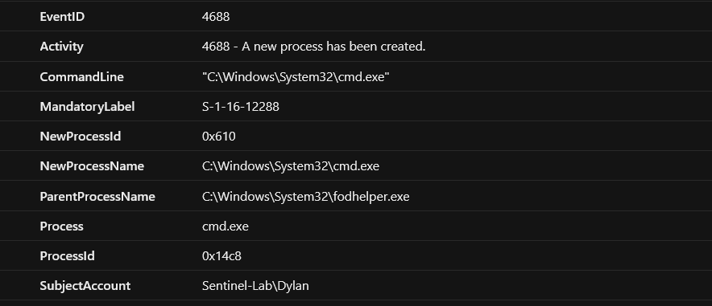

<br>
<br>

4. Filtered on the elevated `cmd.exe` process ID (`0x610`) to find any child processes created afterward.

```kql
SecurityEvent
| where TimeGenerated between (datetime(2025-12-17 18:28:00) .. datetime(2025-12-17 18:40:00))
| where Computer == "Sentinel-Lab"
| where EventID == 4688
| where ProcessId == "0x610"
| order by TimeGenerated asc
```


Only `conhost.exe` was observed as a process of the elevated `cmd.exe` instance during the investigation window.

<br>
<br>


### Findings

- `cmd.exe` ran `reg.exe` to set `HKCU\Software\Classes\ms-settings\shell\open\command` to `C:\Windows\System32\cmd.exe`.
- Event ID 4657 confirmed the key was modified by `reg.exe` and the new value was `cmd.exe`.
- `fodhelper.exe` executed with `cmd.exe` as the parent process.
- `fodhelper.exe` spawned a high integrity `cmd.exe` (`S-1-16-12288`, `%%1937`).
- Filtering on PID `0x610` showed only `conhost.exe` spawned afterward. No other child processes were found.

<br>
<br>

### Recommendations

- Response - 
    - Isolate the host
    - Remove the malicious key values
    - Search for persistence or changes made under the high integrity process and remove anything found
    - Check for other registry values changed
    - Reset credentials for the user
- Prevention - 
    - [M1052 - User Account Control](https://attack.mitre.org/mitigations/M1052/):
        - Require credential prompt instead of just confirmation via Group Policy (`User Account Control: Behavior of the elevation prompt`)
        - Use EDR tools to detect and block known UAC bypass techniques 
    - [M1026 - Privileged Account Management](https://attack.mitre.org/mitigations/M1026/):
        - Remove users from the local administrator group on systems


---

<br>
<br>

</details>


<details>
<summary><strong>Alert 3</strong></summary>

## Alert 3 — T1003.001 (LSASS Memory Dump)

<br>

**Alert Information**
- **Title:** Dumping LSASS Process Into a File  
- **Severity:** High  
- **Time (EST):** Dec 17, 2025 3:12:53 PM  
- **Entity:** Host `Sentinel-Lab`  
- **Incident ID:** 26  


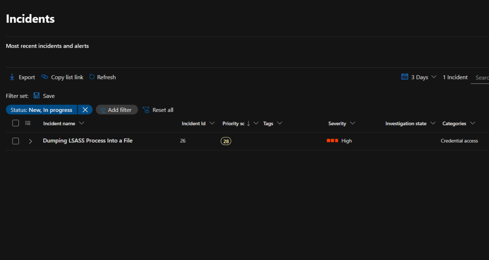

---

<br>


### Summary

Sysmon telemetry showed that `procdump64.exe` accessed `lsass.exe` with full access rights, triggering the alert. Triage of the incident found how procdump was launched and Sysmon file creation events confirmed a dump file was written to `C:\Windows\Temp\lsass_dump-2.dmp`. No outbound network activity for exfiltration was found in the reviewed time window. 

<br>

### Actions Taken

<br>

1. Reviewed the original analytic rule query output to confirm why the rule fired:

```kql
// The query_now parameter represents the time (in UTC) at which the scheduled analytics rule ran to produce this alert.
set query_now = datetime(2025-12-17T21:43:09.6583112Z);
Event
| where EventLog =~ "Microsoft-Windows-Sysmon/Operational" and EventID==10
| parse EventData with * 'TargetImage">' TargetImage "<" * 'GrantedAccess">' GrantedAccess "<" * 'CallTrace">' CallTrace "<" * 
| where GrantedAccess =~ "0x1FFFFF" and TargetImage =~ "C:\\Windows\\System32\\lsass.exe" and CallTrace has_any ("dbghelp.dll","dbgcore.dll")
| parse EventData with * 'SourceProcessGUID">' SourceProcessGUID "<" * 'SourceImage">' SourceImage "<" *
| summarize StartTime = min(TimeGenerated), EndTime = max(TimeGenerated) by EventID, Computer, SourceProcessGUID, SourceImage, GrantedAccess, TargetImage, CallTrace
| extend HostName = iif(Computer has '.',substring(Computer,0,indexof(Computer,'.')),Computer) , DnsDomain = iif(Computer has '.',substring(Computer,indexof(Computer,'.')+1),'')
```

<br>

**Why the rule fired**
- Sysmon EID 10 showed a process accessing `lsass.exe` with `GrantedAccess = 0x1FFFFF`
- Call trace contained `dbgcore.dll`

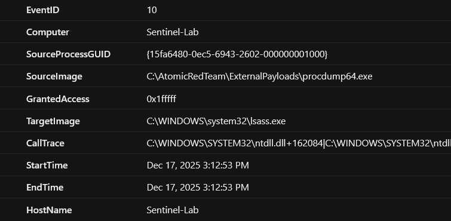

<br>
<br>

2. Reviewed process creation logs to identify how `procdump` was launched and confirm the command line used.

```kql
SecurityEvent
| where TimeGenerated between (datetime(2025-12-17 20:07:00) .. datetime(2025-12-17 20:18:00))
| where Computer == "Sentinel-Lab"
| where EventID == 4688
| where NewProcessName contains "procdump"
| project TimeGenerated, Account, EventID, CommandLine
| order by TimeGenerated asc
```

<br>

Results showed:
- `cmd.exe` spawned `procdump.exe`
- `procdump.exe` then spawned `procdump64.exe`

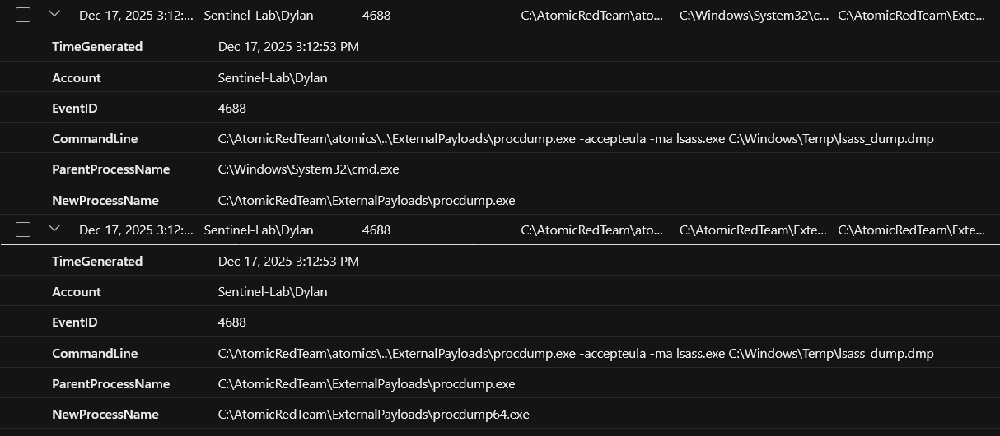

<br>
<br>

3. Checked Sysmon file creation events to identify if and where a dump file was written.

```kql
Event
| where TimeGenerated between (datetime(2025-12-17 20:07:53) .. datetime(2025-12-17 20:32:53))
| where Computer == "Sentinel-Lab"
| where EventLog == "Microsoft-Windows-Sysmon/Operational"
| where EventID == 11
| where RenderedDescription contains "procdump"
| project TimeGenerated, RenderedDescription
| order by TimeGenerated asc
```


Results showed that `procdump64.exe` created the dump file `C:\Windows\Temp\lsass_dump-2.dmp`

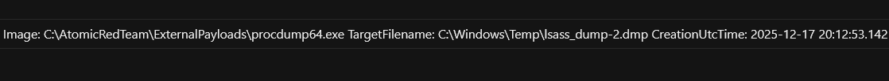

<br>
<br>

4. Reviewed Sysmon EID 3 for the time window to determine whether any outbound connections indicated exfiltration activity.

```kql
Event
| where TimeGenerated between (datetime(2025-12-17 20:07:00) .. datetime(2025-12-17 20:33:00))
| where Computer == "Sentinel-Lab"
| where EventLog == "Microsoft-Windows-Sysmon/Operational" and EventID == 3
| project TimeGenerated, Computer, EventID, RenderedDescription
| order by TimeGenerated asc
```

Network logs did not return any connections except for normal activity in the reviewed time window.


<br>
<br>

### Findings

- Sysmon EID 10 showed `procdump64.exe` accessed `lsass.exe` with `GrantedAccess = 0x1FFFFF` and `dbgcore.dll` was in the call trace.
- 4688 process creation logs showed `cmd.exe` launched `procdump.exe`. `procdump.exe` spawned `procdump64.exe` immediately after.
- Sysmon EID 11 confirmed a dump artifact was created at `C:\Windows\Temp\lsass_dump-2.dmp`.
- No outbound network connections of interest were observed in the reviewed time window.
---

<br>
<br>


### Recommendations

- Response - 
    - Isolate the host and remove/quarantine the dump tool and the dump file
    - Identify impacted accounts and reset passwords
    - Hunt for lateral movement and where the dump file may have gone
- Prevention -
    - [M1040 - Behavior Prevention on Endpoint](https://attack.mitre.org/mitigations/M1040/):
        - Enable [Attack Surface Reduction (ASR) rules](https://learn.microsoft.com/en-us/defender-endpoint/attack-surface-reduction) to secure LSASS
        - Add explicit blocking/detections for common dump tools
    - [M1043 - Credential Access Protection](https://attack.mitre.org/mitigations/M1043/):
        - Use Credential Guard to isolate LSASS memory
        - Enable LSA protection

</details>


<details>
<summary><strong>Alert 4</strong></summary>

## Alert 4 — T1070.001 (Clear Windows Event Logs)

<br>

**Alert Information**
- **Title:** NRT Security Event log cleared  
- **Severity:** Medium  
- **Time (EST):** Dec 16, 2025 1:17:27 PM    
- **Entity:** Host `Sentinel-Lab`  
- **Incident ID:** 8  


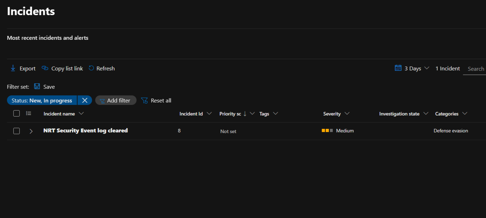

---

<br>


### Summary

This alert triggered because SecurityEvent ID 1102 confirmed the Security audit log was cleared. Triage showed that the clearing was wider than just Security by looking for Event ID 104 for multiple logs in the time window. Process creation logs showed an elevated PowerShell command cleared all logs.

<br>

### Actions Taken

<br>

1. Reviewed the original analytic rule query output to confirm why the rule fired:

```kql
SecurityEvent
| where EventID == 1102 and EventSourceName == "Microsoft-Windows-Eventlog"
| summarize StartTimeUtc = min(TimeGenerated), EndTimeUtc = max(TimeGenerated), EventCount = count() by Computer, Account, EventID, Activity
| extend HostName = tostring(split(Computer, ".")[0]), DomainIndex = toint(indexof(Computer, '.'))
| extend HostNameDomain = iff(DomainIndex != -1, substring(Computer, DomainIndex + 1), Computer)
| extend AccountName = tostring(split(Account, @'\')[1]), AccountNTDomain = tostring(split(Account, @'\')[0])
```

<br>

**Why the rule fired** - Event ID 1102 was logged


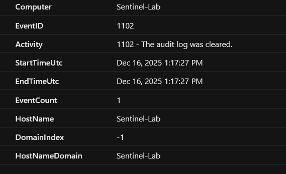

<br>
<br>

2. Validated whether only **Security** was cleared or if other logs were also cleared. Queried the **System** log for Event 104 around the alert time:

```kql
Event
| where Computer == "Sentinel-Lab"
| where EventLog == "System"
| where TimeGenerated between (datetime(2025-12-16 18:00:00) .. datetime(2025-12-16 18:30:00))
| where EventID == 104
| project TimeGenerated, EventID, RenderedDescription
| order by TimeGenerated asc
```

<br>

Results showed Event ID 104 at the same timestamp for multiple logs:
- The **Application** log file was cleared  
- The **HardwareEvents** log file was cleared  
- The **Internet Explorer** log file was cleared  
- The **Key Management Service** log file was cleared  
- The **System** log file was cleared  
- The **Windows PowerShell** log file was cleared  


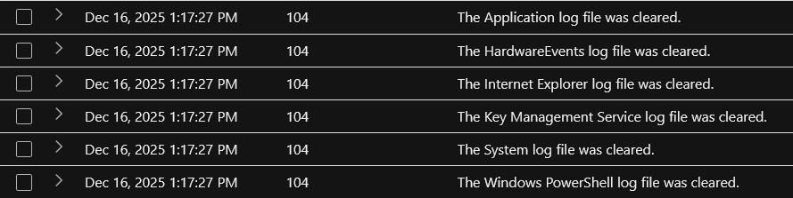

<br>
<br>


3. Confirmed logging was still enabled.  

```kql
Event
| where EventLog == "Microsoft-Windows-Sysmon/Operational"
| where Computer == "Sentinel-Lab"
| where TimeGenerated between (datetime(2025-12-16 18:18:00) .. datetime(2025-12-16 18:37:00))
| summarize count() by EventID
```

<br>

Results - Logging is still enabled and being forwarded to Sentinel.

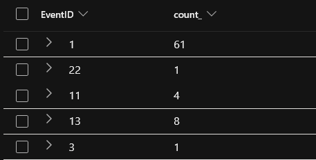

<br>
<br>

4. Found how Event logs were cleared 


```kql
SecurityEvent
| where EventID == 4688
| where TimeGenerated between (datetime(2025-12-16 18:13:00) .. datetime(2025-12-16 18:18:00))
| where CommandLine has_any ("wevtutil", "Get-WinEvent", "Clear-EventLog")
| project TimeGenerated, SubjectAccount, EventID, Process, CommandLine, MandatoryLabel
```
<br>

Results showed that the log sources were cleared with the following command on a high integrity powershell instance - `"powershell.exe" & {$logs = Get-EventLog -List | ForEach-Object {$_.Log} $logs | ForEach-Object {Clear-EventLog -LogName $_ } Get-EventLog -list}`

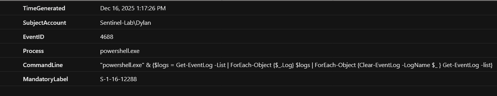

<br>
<br>

### Findings


- Security audit log cleared at **Dec 16, 2025 1:17:27 PM EST**
- System log review returned `Event ID` **104** at the same timestamp, showing additional logs were cleared:
    - Application
    - HardwareEvents
    - Internet Explorer
    - Key Management Service
    - System
    - Windows PowerShell
- Sysmon logging was still enabled and forwarding to Sentinel after the clearing.
- An elevated `powershell.exe` instance enumerated logs and cleared them

<br>
<br>

### Recommendations

- Response -
    - Isolate the host
    - Use Sentinel logs to find additional attacker activity before and after the log clearing
    - Reset the account that cleared the logs and review privileged activity
    - Remove any persistence mechanisms found
- Prevention - 
    - [M1022 - Restrict File and Directory Permissions](https://attack.mitre.org/mitigations/M1022/):
        - Protect generated event files that are stored locally with proper permissions and authentication and limit opportunities for adversaries to increase privileges by preventing Privilege Escalation opportunities.
        - Use File Integrity Monitoring (FIM) tools to monitor changes to critical file permissions
    - [M1026 - Privileged Account Management](https://attack.mitre.org/mitigations/M1026/):
        - Restrict and monitor admin usage because clearing logs typically requires elevated privileges
    - [M1029 - Remote Data Storage](https://attack.mitre.org/mitigations/M1029/):
        - Configure endpoints to forward security logs to a centralized log collector or SIEM (Sentinel)

</details>

